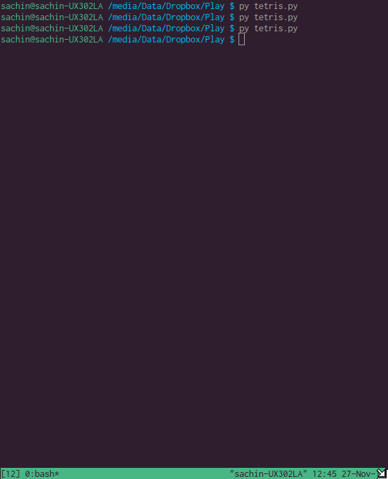
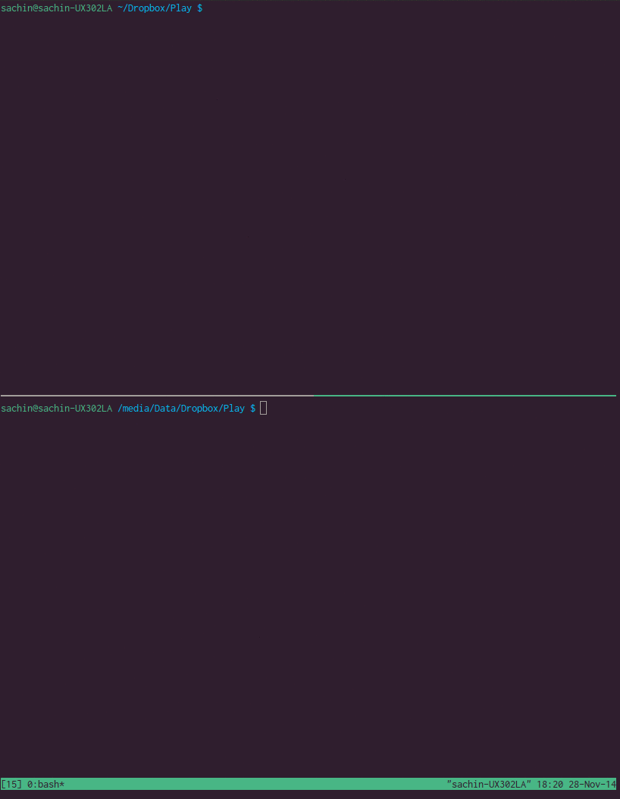

tetris-multiplayer
==================

a single/multiplayer tetris game that runs on your terminal (Mac/Linux). [A more detailed write up.](http://sachinrudr.github.io/scribble/project/2014/11/26/tetris/)

#### Single Player

#### Multiplayer

### Requirements

1. python2 (python 3 won't work)
2. curses (Mac/*nix b/c windows doesn't have this unfortunately)

### Play

1. get tetris.py and make it executable
2. run it with options (optional)

`tetris.py $NAME` for single player, or multiplayer SERVER    
`tetris.py $NAME $HOSTNAME $PORT` for multiplayer CLIENT. use HOSTNAME and PORT given by SERVER

